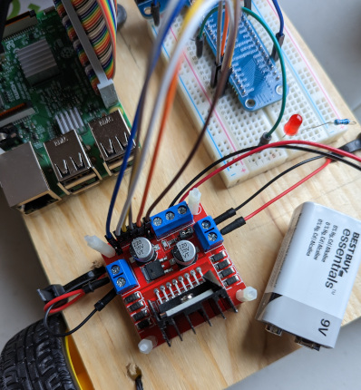

# roboberryPi

## Author

Megan Galbraith


## Project Summary

roboberry Pi (naming things is _hard_) is an IoT project that aimed to create a
mobile robot that could be controlled by another device on the network. It's
"brain" is a Raspberry Pi 3B, which allows it to also act as a web server. 
An on-board web server is necessary for a web-based GUI to control the robot.
roboberry controls include: direction, speed, light on/off.


To avoid CORS (cross-origin resource sharing) issues, roboberry only operates
on a LAN (local access network). While http GET requests typically aren't
impacted by CORS, operations such as POST (which is used in roboberry's APIs)
are restricted by browsers for security purposes. 

roboberry was inspired by this [Autodesk Instructables](https://www.instructables.com/IoT-Controlling-a-Raspberry-Pi-Robot-Over-Internet/) project. A lot of the
initial construction of the scripts and physical components were based off this,
but I made certain adaptations along the way, such as compiling the multiple
movement control scripts into just two scripts that accept arguments.

A note about pulse width modulation (PWM): this is a technique to control the power being supplied to something. A certain number of pulses are produced every time cycle, with the length of the pulse corresponding to how much of the supplied power a component will receive. For example, if the pulse is active for half the time, the component will only receive half of the full power source (see image below).


(Image from [Last Minute Engineers](https://lastminuteengineers.com/l293d-dc-motor-arduino-tutorial/))


## Video Presentation

Check out my video presentation on [YouTube]().


## Components

- Raspberry Pi model 3B
- L298N motor driver
- 2 gear motors with wheels
- Solderless breadboard
- GPIO expansion board with GPIO cable (optional)
- Jumper wires (male-to-male and female-to-male)
- 4-6 LEDs, at least 2 colours (to test gpio control logic)
- 4-6 330 Ohm resistors (for the LEDs)
- Power sources: 1 for your Pi (for mobility), 1 for the motors


## Building It

### The Physical Components

A lot of the initial building was influenced by the [reference project](https://www.instructables.com/IoT-Controlling-a-Raspberry-Pi-Robot-Over-Internet/). Once I had the basic movement scripts loaded onto the Pi, I wired up the breadboard to test if I had my control logic right. By using red/yellow pairs of LEDs, I could see that the gpio pins were paired properly for running the motors. I used a green LED to test the PWM functionality, and the final red LED would remain as the operable LED for the completed project.


Now that I knew the logic was correct, I tested wiring up each motor to make 
sure I had the motors correctly polarized (ie, they turn the wheels in the 
expected direction). I'm using a L298N motor driver to simplify the motor 
control. I also think it cuts down on the number of wires needed compared to 
using an L293D H bridge, as suggested in the reference project. (Also, electronics supply issues are still a thing and this is what I could get). The L298N has two motor control ports, three power ports (only two used in this case for a 9 volt battery strap to power the motors), four motor control pins (forward and reverse for each motor), and two PWM pins.



For the completely assembled roboberry itself, I drilled holes in a spare piece of wood and used cable ties, twist ties, nylon spacer screws, and self-sticking velcro to hold everything together. The 9 volt battery for the motors is stuck to the top of the board while the larger battery pack (5V/3A supply) is attached to the bottom to power the Pi. I also stole a caster wheel off an old drawer set for the rear wheel (adding two more motor-based wheels is an alternative option).


### The Software Components

Rather than write my own gpio control, I used the [WiringPi](https://github.com/WiringPi/WiringPi) gpio control library. Since this was a project about networks, it seemed a little over the top to put extra work into low level hardware controls. Plus, this sped up my circuit prototyping.

Having eight scripts that basically do the same thing (based on the reference project) brakes the design principle of code re-use, so once I knew that all of those scripts worked as expected, I refactored them into two scripts that accepted arguments. This could have technically been executed in a single script, but for the sake of speed of execution, I opted for a script that mainly controls the movement while another just changes the speed. This means less information collection on the front end (and thus, less data having to be sent over the network) and less unnecessary gpio pin re-writes in the back-end.

I took the base of the Python web server from a previous assignment ([chat app](https://github.com/galbrame/localhostChatApp)) and modified it to specifically deal with the API calls for this project. I also added in a command to set the PWM pin modes whenever index.html is requested. It was difficult to troubleshoot, but for some reason, setting the PWM gpio pins at boot time wouldn't make them accessible to a user running the GUI. They were correctly assigned in the system, but they would not respond to input. I believe this has something to do with the user status at boot time (root vs my auto-login username). Since the web server is also launched at boot time, putting the command at the beginning of the server also did not work, but by the time index.html is being requested, we know everything else has caught up to the correct permissions.


## How to Run

I highly recommend reading through the [reference project](https://www.instructables.com/IoT-Controlling-a-Raspberry-Pi-Robot-Over-Internet/) before trying to install your own roboberryPi. It will tell you more about how some of the electronic components work than you'll find here.

1. Clone this repo to your Raspberry Pi (may work on other models, but I make no guarantees): ```git clone https://github.com/galbrame/roboberryPi.git```
2. Change the WEB_SERVER variable in assets/roboScript.js to whatever your Pi is on your LAN
3. Clone and install WiringPi: ```git clone https://github.com/WiringPi/WiringPi.git
cd wiringPi
./build```
4. Edit `/etc/rc.local` to change the gpio modes and run webserver.py at boot: ```sudo nano /etc/rc.local```

    - ```...
    gpio -g mode 5 out
    gpio -g mode 6 out
    gpio -g mode 13 out
    gpio -g mode 19 out
    gpio -g mode 10 out
    cd /
    python /home/_\<username\>_/roboberryPi/webserver.py
    cd /
    ...
    exit 0```
    
    - NOTE: Your Pi may work differently, but my Pi seems to launch the webserver more reliably if I navigate to the home folder first
5. Reboot the Pi: ```sudo reboot```
6. Once the pi is booted, you should be able to find the GUI at your local address on port 5000

The GUI was tested on both Mozilla Firefox and Google Chrome, but better responsiveness was occasionally observed on the Chrome browser, for whatever reason.


## What Did I Learn?

I learned a little bit about simple circuits, such as proper grounding and adding appropriate resistors for lower voltage components, like LEDs. I also got to do some light Bash shell scripting, which I've never really played with before. Learning Bash regular expressions is... a learning curve.

Additionally, I finally learned command line git. I had only used git on GUIs for projects before.


## Ideas for Future Iterations

- Handle multiple users by tracking cookies or a list of TCP connections managed by the webserver or something
- Swivel camera attachment with a viewport on the GUI to see where you're driving
- Operate on WAN instead of LAN
- Use a more intuitive form of control, such as a virtual joystick


## Resources

1. The initial inspiration for the project: [IoT - Controlling a Raspberry Pi Robot Over Internet With HTML and Shell Scripts Only](https://www.instructables.com/IoT-Controlling-a-Raspberry-Pi-Robot-Over-Internet/) by Marcelo Rovai

2. Library for controlling the gpio pins through shell scripts: [WiringPi](https://github.com/WiringPi/WiringPi), an unofficial fork of original WiringPi by Gordon (last name unknown)